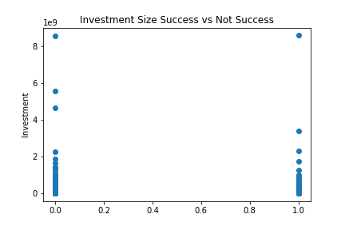

# Alphabet Soup Charity Analysis

##### An effort to predict whether investment in a charity will result in successful fundraising or unsuccessful fundraising based on data features we know from a series of previous applicants
---

### Data Processing

* The target of this model is `IS_SUCCESSFUL`, a column in the dataframe that offers input on the results of charitibale organization models that successfully met their fundraising goals.
* The features are as follows: `APPLICATON_TYPE`, `AFFILIATION`, `CLASSIFICATION`, `USE_CASE`, `ORGANIZATION`, `STATUS`, `INCOME_AMT`, `SPECIAL_CONSIDERATIONS`, `ASK_AMT`
* The data removed because are neither of the above are: `EIN`, `NAME`
* Many of the features were categorical so one-hot-encoding was used to put binary results into individual categorical input columns. That being said, one of the very few numerical features was `ASK_AMT` which had a tremendous range, therefore the data was scaled so the information wouldn't become weighted, espcially since it did not appear to be a well defining predictor of the result. It may have played a role, but was clearly not isolated well enough that it alone could predict the result of success, as you can see here: 

---

### Compiling, Training, Evaluating the Model

* In the first model there were 4 total layers, the input layer uses a count of neurons equal to that of the columns in the training dataset. The first hidden layer uses 80 neurons, chosen for being approximately 60% greater than the neural input. The second hidden layer uses only 30 neurons. All 3 of the former activate with ReLU. The final layer has just the one, activated with sigmoid.  
     
In effort to optimize `AlphabetSoupCharity_Optimization3` the layers were increased by one. The first hidden layer was increased to 150 neurons, because that is approximately 200% larger than the input layer. The following two hidden layers were reduced to 15, because although 15 is less potential for learning than 30, two of them back to back have a much greater potential for learning, while sacrificing less efficiency.

In `AlphabetSoupCharity_Optimization4`, ReLU was switched to Tanh.

Finally, in `AlphabetSoupCharity_Optimization` an auto-tuner was implemented to find the best possible accuracy results, to find the best possible combination of layers, neurons, activation types (from a limited list of a great many possibilities).

* None of these achieved the 75% accuracy that these efforts were trying to perform.

* Apart from the neural network changes listed above, other steps were taken in attempt to increase performance.

* In `AlphabetSoupCharity_Optimization1` two more columns were removed from the preprocessed dataset because they were suspected as being potentially redundant or causing misleading noise.

* In `AlphabetSoupCharity_Optimization2` the threshold limits bucketing two features into an "other" categorical designation were adjusted to include more relevant data, or exclude noisy data.

* In `AlphabetSoupCharity_Optimization5` the training set ratio was adjusted up from 75% to 85% to see if more teaching of the model might increase the accuracy.
---

### Summary
* The very first neural network created was approximately as accurate as any other attemts, regardless of the adjustments, tuning, and even using an automated tuner optimization technique, which tested hundreds, thousands of various models. In the future, if this is going to be tested further I might try to use another method of modeling altogether, like a random forest, or perhaps PCA.  Maybe within the multiple noisy inputs we have going into this database, if the features are all scrambled into just a small handful of features.  For now, it looks like the best educated guess we can safely make is about a 72%-73% accurate prediction that a charity will successfully achieve its fundraising goal.
---

##### Authors:
* John Torgerson (JohnTorgerson)
---